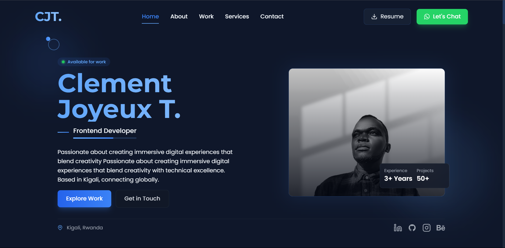
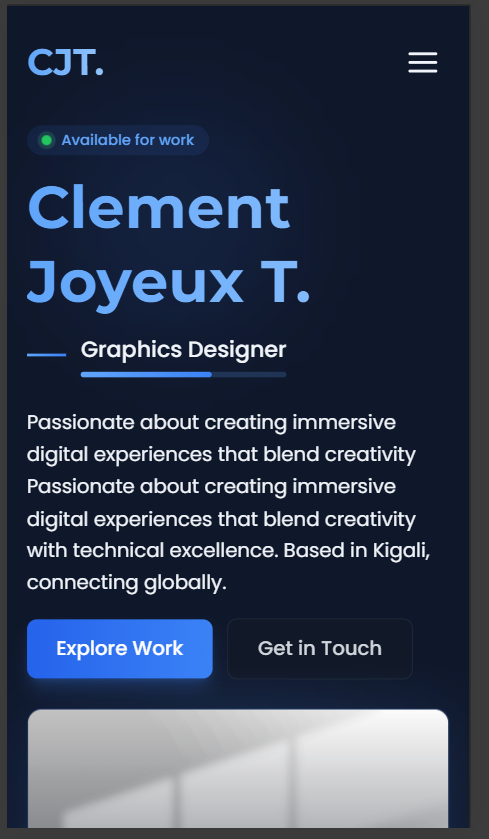

# 🚀 Clement Joyeux - Portfolio



## 🌟 Overview

A modern, responsive portfolio website built with Next.js, React, Tailwind CSS, and Framer Motion. Featuring a dark theme, smooth animations, and an intuitive user interface.

## ✨ Features

- 🎨 Modern UI/UX with dark theme
- 📱 Fully responsive design
- 🔄 Smooth page transitions
- ⚡ Fast performance
- 🎭 Interactive animations
- 🔍 SEO optimized
- 📊 Project showcase
- 📬 Contact form integration

## 🛠️ Tech Stack

- **Frontend Framework:** Next.js
- **UI Library:** React
- **Styling:** Tailwind CSS
- **Animations:** Framer Motion
- **Icons:** React Icons
- **Deployment:** Vercel

## 🚀 Getting Started

1. **Clone the repository**
```bash
git clone https://github.com/joyeuxclement87/tjoyeuxclement.git
```

2. **Install dependencies**
```bash
cd portfolio
npm install
```

3. **Run development server**
```bash
npm run dev
```

4. **Open browser**
Navigate to `http://localhost:3000`

## 📂 Project Structure

```
portfolio/
├── components/         # React components
├── public/            # Static assets
├── styles/           # Global styles
└── utils/            # Utility functions
```

## 🎨 Color Palette

| Color   | Hex Code  | Usage        |
|---------|-----------|--------------|
| Primary | `#3B82F6` | Buttons, Links |
| Dark BG | `#030712` | Background  |
| Accent  | `#60A5FA` | Highlights  |

## 🌐 Live Demo

Visit the live portfolio: [https://clement-portfolio.vercel.app](https://your-portfolio-url.com)

## 📱 Screenshots

<div align="center">
  
  
</div>

## 📝 License

MIT License - feel free to use this template for your own portfolio!

## 👤 Contact

- Website: [clement-portfolio.com](https://your-website.com)
- Instagram: [carpricorn_gboy](https://www.instagram.com/carpricorn_gboy/)
- GitHub: [joyeuxclement87](https://github.com/joyeuxclement87)
- LinkedIn: [Clement Joyeux](https://www.linkedin.com/in/tuyishimire-joyeux-clement-32418528a/)
- Behance: [Clement](https://www.behance.net/joyeuxclement)

---

<div align="center">
  Made with ❤️ by Clement Joyeux
</div>
